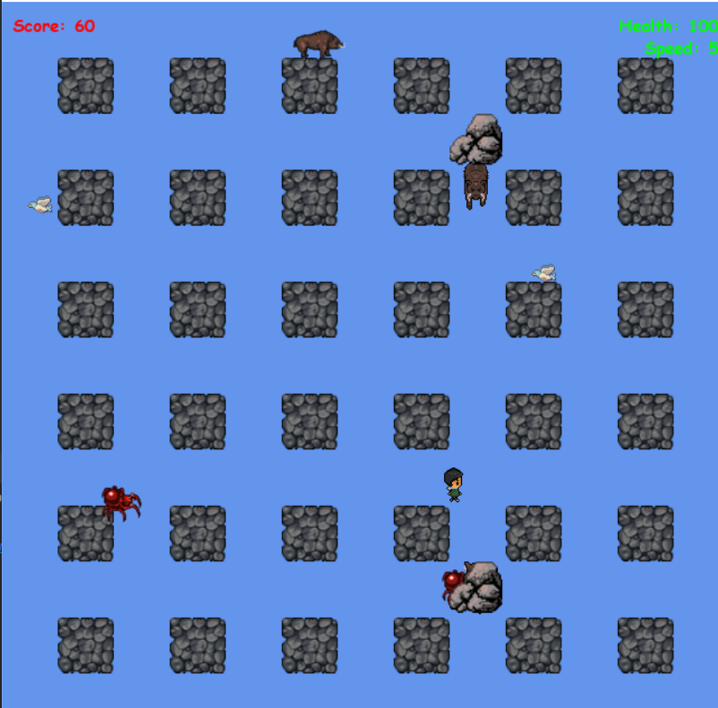

# Bomberman pygame application

Version of well-known game Bomberman using Pygame Technology 


## Installation

Python3 must be already installed

```shell
git clone https://github.com/alexandra-halytska/bomberman
python3 -m venv venv
source venv/bin/activate on Mac OS or venv\Scripts\activate on Windows
pip install -r requirements.txt
run from main.py
```

## Features

* Bomberman who plants bombs
* Spawning enemies
* Healing, rise score and another effects

## Demo



